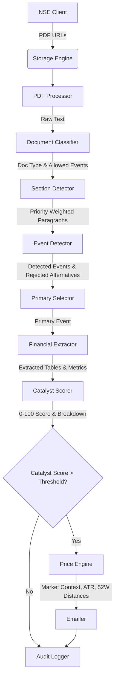

# NSE Catalyst Scanner: Developer Guide

This document is the definitive guide to maintaining, extending, and operating the NSE Catalyst Scanner. 
The system is built as a highly deterministic, context-aware equity research engine. **It does not use AI for event detection.** All intelligence is built via hard-coded relationship graphs, priority weights, and strict evidence checklists to ensure 100% reproducibility and institutional safety.

## 1. Architecture Diagram



## 2. Module Responsibilities

| Module | Responsibility |
|--------|----------------|
| `main.py` | The orchestrator. Coordinates the data pipeline and generates the JSON `AUDIT_LOG`. |
| `nse_client.py` | Connects to the NSE India API to fetch live PDF announcements. |
| `document_classifier.py` | Examines the PDF title and first 1000 characters to determine the broad nature of the filing (e.g. "Quarterly Results", "AGM Notice"). **Controls the `allowed_events` gatekeeper.** |
| `section_detector.py` | Examines paragraphs within the text and assigns Priority Multipliers. "Resolutions" get 100% weight, "Notices" get 40%, and "Voting" gets 0% (filtered out). |
| `event_detector.py` | The Single Source of Truth. Parses text looking for strict Action + Noun + Condition relationship graphs within N-1 to N+1 sentences. |
| `primary_selector.py` | Resolves conflicts if multiple events are found. Selects the highest priority catalyst. |
| `financial_extractor.py` | Regular Expressions engine designed to extract localized values (Order values in Crores, Dividends, Bonus Ratios). |
| `catalyst_scorer.py` | Generates a 0-100 score strictly by summing weighted factors (Evidence, Magnitude, Section Quality, Penalties). Emits a fully traceable `ScoreBreakdown`. |
| `price_engine.py` | Hooks into `yfinance` to grab Market Cap, Current Price, Support/Resistance (via ATR), and 52W distances. Safely aborts if data is corrupted. |
| `emailer.py` | Renders a clean, institution-grade HTML equity research memo. |

## 3. Event & Scoring Flow

### The Event Flow
1. **Gatekeeper Check**: If a document is flagged as an "AGM Notice", the Document Classifier explicitly bans "Government Contract" from being detected, instantly eliminating false positives.
2. **Section Weighting**: Even if a valid "Order Win" is found, if it is located inside a section titled "Notice of Meeting", its confidence is slashed by 60%.
3. **Relationship Graph**: `event_detector.py` will not trigger unless the Action (`awarded`), Noun (`contract`), and Condition (`Railway`) are all found within 3 sentences of each other. 
4. **Explainability Trace**: If an event fails, the exact failure reason (e.g., "Missing Action checklist") is pushed to the `rejected_alternatives` log for debugging.

### The Scoring Flow
The final 0-100 score is built transparently:
- **Evidence Base (35 pts)**: Driven by the Event Graph and Section Priority.
- **Financial Magnitude (20 pts)**: Strictly scaled dynamically against the company's live Market Capitalization.
- **Compatibility (18 pts)**: Does the document type match the event?
- **Freshness (10 pts)**: Is this a final resolution or a preliminary discussion?
- **Section Quality (8 pts)**: Was the extraction clean?
- **Priority Base (9 pts)**: Hard-coded institutional value of the catalyst type.

## 4. Adding New Event Types

To add a new event type (e.g., "Rights Issue"), you must touch **exactly three files**:

1. **`document_classifier.py`**: Add the keywords to recognize a Rights Issue document, and add "Rights Issue" to the `allowed_events` arrays where appropriate.
2. **`event_detector.py`**: Add the strict validation logic to the `self.rules` dictionary:
   ```python
   "Rights Issue": {
       "actions": [r"\bapproved\b", r"\bproposed\b"],
       "nouns": [r"\brights issue\b"],
       "conditions": [r"crore", r"ratio"]
   }
   ```
3. **`template_engine.py`**: Add the HTML email template blocks for "Rights Issue" explaining *Why It Matters* and *Investment Impact*.

## 5. Benchmarking & Testing

The benchmark suite is located in `tests/test_intelligence.py`. 

### The Permanent Benchmark Rule
The project enforces a **Regression Protection Policy**. You must never merge code unless it passes the Benchmark Framework with `100% Accuracy` and `0 False Positives` on the core dataset.
If you find a new edge case in production, you must:
1. Copy the raw text of the failing PDF block.
2. Add it to the `dataset` dictionary in `test_intelligence.py` with the `expected_event` you want.
3. Fix the `event_detector.py` logic until the test passes.

Run tests using:
```bash
PYTHONPATH=. venv/bin/python tests/test_intelligence.py
```

## 6. Common Failure Cases

- **yfinance Rate Limits**: The Yahoo Finance API aggressively rate-limits requests. The `price_engine.py` handles this gracefully by returning a `0` market cap. The system will fall back to absolute magnitude scoring instead of relative normalization.
- **OCR Failures**: If a PDF consists entirely of scanned images, `pdf_processor.py` will detect it and flag it. Since OCR is not enabled by default, the document will likely fall to `Unknown Document`.
- **False Positives in Annual Reports**: Massive 300-page annual reports will trigger many historical events. The `document_classifier.py` is trained to block all operational events if the document is classified as an Annual Report.

## 7. Future Improvements
- **Tesseract OCR Integration**: Integrate `pytesseract` strictly as a fallback for image-only PDFs.
- **Local LLM Summary Fallback**: Replace the deterministic `Sumy` summarizer with a quantized local LLM (like Llama 3 8B) purely for generating the "What Happened" text string, keeping all routing and event detection strictly deterministic.
- **Database Migration**: Move from the local SQLite `scanner.db` to a managed PostgreSQL instance for horizontal scaling.
